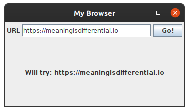

# xemantic-kotlin-swing-dsl
Express your swing code easily in kotlin

This project was born when I had an urgent need to quickly provide a simple 
UI for remote Java application. I needed a remote control for my Robot,
talking over OSC protocol, already coded in Kotlin and based on
[functional reactive programming](https://en.wikipedia.org/wiki/Functional_reactive_programming)
principles (See [we-are-the-robots](https://github.com/xemantic/we-are-the-robots) on GitHub).
I decided to go for Swing, to stay in the same ecosystem, but I remember
the experience of coding GUI in Swing years ago, and I remember what I liked about it
and what was painful. Fortunately now I also have the experience of building
Domain Specific Languages in Kotlin and I quickly realized that I can finally
swing the way I always wanted to.

## Example

```kotlin
fun main() = mainFrame("My Browser") {
  val newUrlEvents = PublishSubject.create<String>()
  val urlEditEvents = PublishSubject.create<String>()
  contentPane = borderPanel {
    layout.hgap = 4
    panel.border = BorderFactory.createEmptyBorder(4, 4, 4, 4)
    north = borderPanel {
      west = label("URL")
      center = textField(10) {
        textChanges.subscribe(urlEditEvents)
        actionEvents.map { text }.subscribe(newUrlEvents)
      }
      east = button("Go!") {
        actionEvents
            .withLatestFrom(
                urlEditEvents,
                BiFunction { _: ActionEvent, url: String -> url }
            )
            .subscribe(newUrlEvents)
        urlEditEvents.subscribe { url -> isEnabled = url.isNotBlank() }
      }
    }
    center = label {
      horizontalAlignment = SwingConstants.CENTER
      verticalAlignment = SwingConstants.CENTER
      preferredSize = Dimension(300, 300)
      urlEditEvents.subscribe { value -> text = "Will try: $value" }
      newUrlEvents.subscribe { value -> text = "Cannot load: $value" }
    }
  }
  urlEditEvents.onNext("") // makes sure we receive the first empty url
}
```

Will produce:



Benefits:

* compact code, minimal verbosity
* declarative instead of imperative
* functional reactive programming way of handling events (RxJava)
* component encapsulation, communication through well defined event streams
* `swingScheduler` for receiving asynchronously produced events (see below)

End here equivalent code in Java for the sake of comparison:

```java
public class JavaWay {

  public static void main(String[] args) throws InvocationTargetException, InterruptedException {
    SwingUtilities.invokeAndWait(
        new Runnable() {
          private final JLabel displayLabel = new JLabel();

          private void onNewUrl(String url) {
            displayLabel.setText("Cannot load: " + url);
          }

          @Override
          public void run() {
            JFrame frame = new JFrame("My Browser");

            displayLabel.setHorizontalAlignment(SwingConstants.CENTER);
            displayLabel.setVerticalAlignment(SwingConstants.CENTER);
            displayLabel.setPreferredSize(new Dimension(300, 300));

            JPanel contentPanel = new JPanel(new BorderLayout());

            JPanel northContent = new JPanel(new BorderLayout(4, 0));
            northContent.add(new JLabel(("URL")), BorderLayout.WEST);
            northContent.setBorder(BorderFactory.createEmptyBorder(4, 4, 4, 4));

            JTextField urlBox = new JTextField(10);
            JButton button = new JButton("Go!");
            button.setEnabled(false);

            button.addActionListener(e -> onNewUrl(urlBox.getText()));
            northContent.add(button, BorderLayout.EAST);

            urlBox.addActionListener(e -> onNewUrl(urlBox.getText()));
            urlBox
                .getDocument()
                .addDocumentListener(
                    new DocumentListener() {
                      @Override
                      public void insertUpdate(DocumentEvent e) {
                        fireChange(e);
                      }

                      @Override
                      public void removeUpdate(DocumentEvent e) {
                        fireChange(e);
                      }

                      @Override
                      public void changedUpdate(DocumentEvent e) {
                        fireChange(e);
                      }

                      private void fireChange(DocumentEvent e) {
                        String text = urlBox.getText();
                        displayLabel.setText("Will try: " + text);
                        button.setEnabled(!text.trim().isEmpty());
                      }
                    });
            northContent.add(urlBox, BorderLayout.CENTER);


            contentPanel.add(northContent, BorderLayout.NORTH);
            contentPanel.add(displayLabel, BorderLayout.CENTER);
            frame.setContentPane(contentPanel);
            frame.setDefaultCloseOperation(WindowConstants.EXIT_ON_CLOSE);

            frame.pack();
            frame.setVisible(true);
          }
        });
  }
}
```

## Swing scheduler

By default everything in Swing is supposed to run on the same thread. Any
update to any GUI component should happen there, otherwise concurrency might
cause consistency issues. But in many cases long running computation, or asynchronous
IO, will require us to receive results in one thread and display them in the main
Swing thread. This is what Rx Swing scheduler is for:

```kotlin
fun main() = mainFrame("SwingScheduler example") {
  contentPane = label{
    Observable.interval(1, TimeUnit.SECONDS)
        .observeOn(swingScheduler)
        .subscribe { tick -> text = tick.toString() }
    preferredSize = Dimension(100, 100)
    horizontalAlignment = SwingConstants.CENTER
  }
}
```

The `ticks` can be seen as an event pipeline, `Observable.interval` will publish events to it every
second, but it runs on so called computation scheduler of RxJava library by default. For this reason
we do `tick.observeOn(swingScheduler)` which will guarantee that actual reaction to the tick will
happen in the Swing thread. It is not needed most of the time as the default scheduler
for receiving the events will be usually the same as the one used for publishing them, and this one
is already the Swing event thread.
